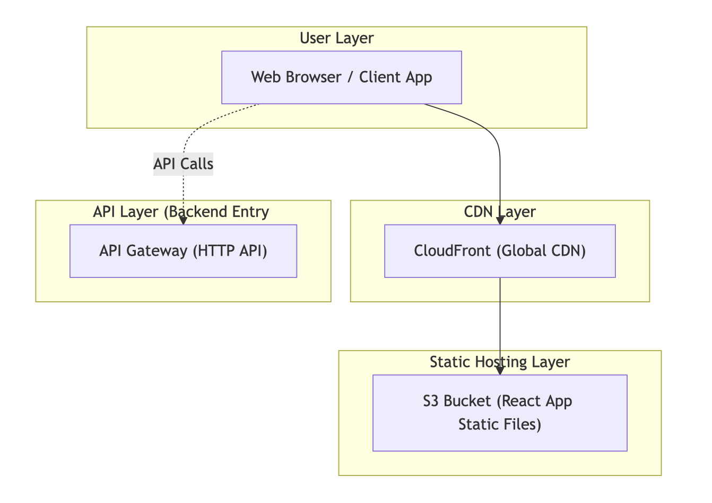

# Medication Management App

A modern React + TypeScript single-page application for managing medication schedules and tracking upcoming doses. Built with Vite, Tailwind CSS, and React Router.

## Features

- **View Upcoming Doses**: See all scheduled medication doses grouped by date (Today, Tomorrow, This Week, Later)
- **Create Medications**: Add new medications with daily or weekly schedules
- **Mark as Taken**: Track when doses are taken
- **Modern UI**: Clean, responsive design with smooth animations
- **Notifications**: Success and error notifications for user actions
- **Local Storage**: Automatically manages care recipient ID

## Prerequisites

- **Node.js** (v18 or higher recommended)
- **npm** or **yarn**
- Access to the medication API backend

## Quick Start

### 1. Install Dependencies

```bash
npm install
```

### 2. Configure Environment

Create a `.env` file in the root directory:

```bash
cp .env.example .env
```

Or create `.env` manually with:

```env
VITE_API_URL=https://d1cqiieioszb2s.cloudfront.net
```

**Note**: Replace `https://d1cqiieioszb2s.cloudfront.net` with your actual API base URL if it differs in your environment.

### 3. Start Development Server

```bash
npm run dev
```

The app will be available at `http://localhost:5173` (or the next available port).

### 4. Build for Production

```bash
npm run build
```

Preview the production build:

```bash
npm run preview
```

## Deployment to AWS (Serverless)

The application can be deployed to AWS S3 and CloudFront using the Serverless Framework.

### Prerequisites

- AWS CLI configured with appropriate credentials
- Serverless Framework installed globally or as a dev dependency
- AWS account with permissions to create S3 buckets and CloudFront distributions

### Install Serverless Framework

If not already installed:

```bash
npm install -g serverless
```

Or install as a dev dependency:

```bash
npm install -D serverless
```

### Configure AWS Credentials

Ensure your AWS credentials are configured:

```bash
aws configure
```

Or set environment variables:

```bash
export AWS_ACCESS_KEY_ID=your-access-key
export AWS_SECRET_ACCESS_KEY=your-secret-key
export AWS_REGION=us-east-1
```

### Deploy

Before deploying, ensure your `.env` file contains the production API URL:

```env
VITE_API_URL=https://d1cqiieioszb2s.cloudfront.net
```

**Important**: The `VITE_API_URL` from your `.env` file will be embedded into the JavaScript bundle during the build process. Make sure it's set to your production API URL (for example, `https://d1cqiieioszb2s.cloudfront.net`) before deploying.

Deploy to AWS:

```bash
npm run deploy
```

This command will:
1. Build the application (`npm run build`)
2. Deploy to AWS using Serverless Framework
3. Create/update the S3 bucket (`medication-app-spa-bucket`)
4. Sync the `dist` folder to S3
5. Create/update the CloudFront distribution

### Deployment Details

The `serverless.yml` configuration:
- **S3 Bucket**: `medication-app-spa-bucket` (static website hosting enabled)
- **CloudFront Distribution**: CDN for fast global delivery
- **Region**: `us-east-1`
- **Build Output**: `dist` folder (Vite build output)

### Architecture Overview

The frontend is built as a React single-page application and is hosted in an S3 bucket as static files. To make the app load fast and be accessible from anywhere, I placed CloudFront on top of S3 as the CDN layer. CloudFront handles caching, HTTPS, and global distribution, while S3 simply serves the built React files. The browser loads all the UI from CloudFront, and any API requests from the frontend go directly to API Gateway, which connects to the backend.



### Updating the Deployment

To update the deployment after making changes:

1. Update your code
2. Ensure `.env` has the correct API URL
3. Run `npm run deploy`

### Environment Variables in Production

**Note**: Since Vite embeds environment variables at build time, the API URL from your local `.env` file will be hardcoded into the production bundle. To change the API URL:

1. Update the `VITE_API_URL` in your local `.env` file
2. Rebuild and redeploy: `npm run deploy`

The `.env` file itself is never deployed to S3 - only the built JavaScript files (which contain the embedded API URL) are deployed.

## Testing the Application

### Initial Setup

1. **Start the app**: Run `npm run dev`
2. **Open browser**: Navigate to `http://localhost:5173`
3. **Check console**: Ensure no errors appear in the browser console

### Test Scenarios

#### 1. View Upcoming Doses

- **Expected**: The main page loads showing upcoming medication doses
- **What to check**:
  - Doses are grouped by date (Today, Tomorrow, This Week, Later)
  - Each dose card displays:
    - Medication name
    - Dosage information
    - Scheduled time with color-coded badge
    - Recurrence type (DAILY/WEEKLY)
    - Notes (if available)
  - Time badges show different colors:
    - Green: More than 2 hours away
    - Amber: Less than 2 hours away
    - Red: Overdue or missed

#### 2. Create a New Medication (Daily)

1. Click the **"+ New Medication"** button (floating button, bottom right)
2. Fill in the form:
   - **Name**: e.g., "Ibuprofen"
   - **Dosage**: e.g., "200mg"
   - **Notes**: (optional) e.g., "Take with food"
   - **Recurrence**: Select "Daily"
   - **Times of day**: 
     - Use the time picker to select a time (e.g., 08:00)
     - Click "Add" to add the time
     - Add multiple times if needed
   - **Active**: Toggle on/off
3. Click **"Create"**
4. **Expected**: 
   - Success notification appears
   - Drawer closes automatically
   - New medication appears in upcoming doses list

#### 3. Create a New Medication (Weekly)

1. Click **"+ New Medication"** button
2. Fill in the form:
   - **Name**: e.g., "Vitamin D"
   - **Dosage**: e.g., "1000 IU"
   - **Recurrence**: Select "Weekly"
   - **Days of week**: 
     - Select a day from dropdown (Sunday = 0, Monday = 1, etc.)
     - Click "Add" to add the day
     - Add multiple days if needed
3. Click **"Create"**
4. **Expected**: Same as daily medication

#### 4. Mark Dose as Taken

1. Find an upcoming dose with status "UPCOMING"
2. Click the **"Mark as Taken"** button
3. **Expected**:
   - Button shows loading state ("Marking...")
   - After success, button changes to "Taken" with checkmark
   - Dose status updates in the list

#### 5. Error Handling

- **Test API Error**: 
  - Temporarily set wrong `VITE_API_URL` in `.env`
  - Try to load doses or create medication
  - **Expected**: Error message displayed in red notification/toast

- **Test Validation**:
  - Try to create medication without name or dosage
  - **Expected**: Error message appears in form

#### 6. Empty State

- If no doses are scheduled:
  - **Expected**: Empty state message "There are no upcoming doses scheduled" with icon

#### 7. Responsive Design

- **Test on different screen sizes**:
  - Desktop: Full layout with side-by-side elements
  - Mobile: Stacked layout, floating button remains accessible
  - **Expected**: Layout adapts smoothly, all functionality works

### Keyboard Shortcuts

- **Escape**: Closes the medication drawer when open

## Project Structure

```
src/
├── components/          # Reusable UI components
│   ├── DoseCard.tsx    # Individual dose card component
│   ├── MedicationDrawer.tsx
│   ├── NewMedicationForm.tsx
│   └── Notification.tsx
├── pages/              # Page components
│   └── UpcomingDosesPage.tsx
├── services/           # API service layer
│   ├── dosesService.ts
│   └── medicationsService.ts
├── utils/              # Utility functions
│   ├── apiClient.ts   # API client with error handling
│   ├── careRecipient.ts
│   └── dateUtils.ts   # Date formatting utilities
├── types/              # TypeScript type definitions
│   ├── dose.ts
│   └── index.ts
├── constants/          # Application constants
│   ├── dose.ts
│   ├── doseStatus.ts
│   └── formDefaults.ts
├── theme.ts            # Theme colors and gradients
└── theme.css           # CSS variables
```

## Code Quality Features

- **Modular Architecture**: Separated concerns (services, components, utils, types)
- **Type Safety**: Full TypeScript coverage with strict types
- **Error Handling**: Custom ApiError class with consistent error handling
- **Constants Management**: Magic numbers and strings extracted to constants
- **Reusable Utilities**: Date formatting, API client, etc.
- **Clean Code**: No code duplication, well-organized structure

## API Endpoints Used

- `GET /care-recipients/{careRecipientId}/doses/upcoming` - Fetch upcoming doses
- `POST /care-recipients/{careRecipientId}/doses/taken` - Mark dose as taken
- `POST /medications` - Create new medication

## Troubleshooting

### App won't start

- **Check Node version**: `node --version` (should be v18+)
- **Clear cache**: `rm -rf node_modules package-lock.json && npm install`
- **Check port**: Ensure port 5173 is not in use

### API errors

- **Verify `.env` file exists** and contains `VITE_API_URL`
- **Check API URL** is correct and accessible
- **Check browser console** for detailed error messages
- **Verify CORS** is configured on the API server

### No doses showing

- **Check API connection**: Verify `VITE_API_URL` is correct
- **Check browser console** for API errors
- **Verify care recipient ID** is being generated (stored in localStorage)

## Development Commands

```bash
# Start development server
npm run dev

# Build for production
npm run build

# Preview production build
npm run preview

# Deploy to AWS (builds and deploys)
npm run deploy

# Run linter
npm run lint
```

## Technologies Used

- **React 19** - UI framework
- **TypeScript** - Type safety
- **Vite** - Build tool and dev server
- **Tailwind CSS 4** - Styling
- **React Router DOM** - Client-side routing
- **Font Awesome** - Icons
- **Serverless Framework** - AWS deployment automation

## Browser Support

- Chrome (latest)
- Firefox (latest)
- Safari (latest)
- Edge (latest)

---

**Note for Reviewers**: The app automatically generates and stores a care recipient ID in browser localStorage on first use. This ID is used for all API requests. To test with a fresh state, clear browser localStorage.
